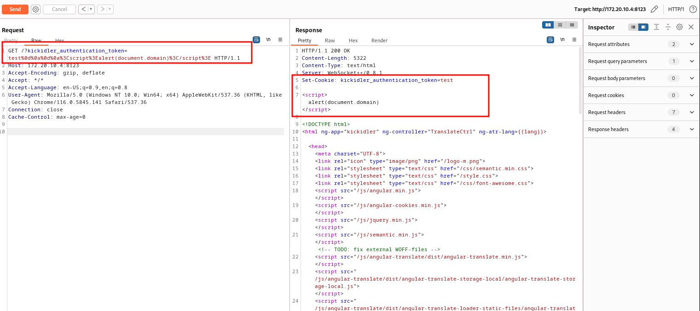
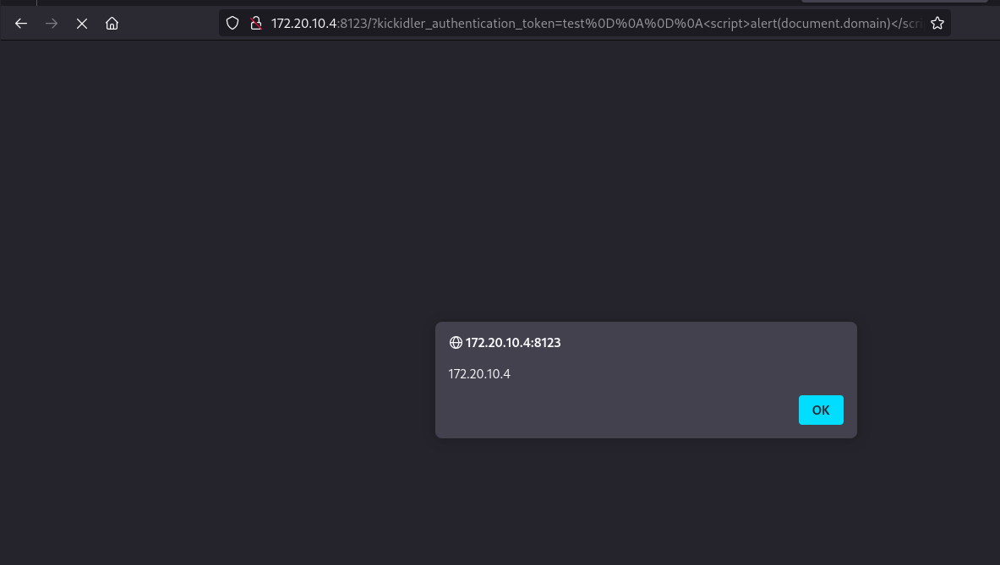

# CVE-2024-25175

## Reflected XSS via HTTP Response Splitting
**Description**: Exploitation of this vulnerability can lead to the execution of JavaScript code in the victim's browser (Cross-Site Scripting) when following a specially crafted link. The vulnerability arises because The web server does not correctly process line breaks (\r\n or CR\LF, in urlencode it is %0d%0a).

**Impact**: Reflected XSS

**CVSSv3.1 vector**: AV:N/AC:L/PR:N/UI:R/S:C/C:L/I:L/A:N (**6.1**)

**CWE**: CWE-20: Improper Input Validation

**Affected Component**: GET parameter `kickidler_authentication_token`

**Vendor**: [Kickidler: Employee Monitoring Software](https://www.kickidler.com/) 

## Affected Product
- Kickdler Server before version 1.107.0

## Steps to reproduce:
```
http://[IP_kickdler_server]:8123/?kickidler_authentication_token=test%0d%0a%0d%0a%3Cscript%3Ealert(document.domain)%3C/script%3E
```


## Discoverer
- Alexander Starikov (Jet Infosystems, https://jet.su)
## References
- https://nvd.nist.gov/vuln/detail/CVE-2024-25175
